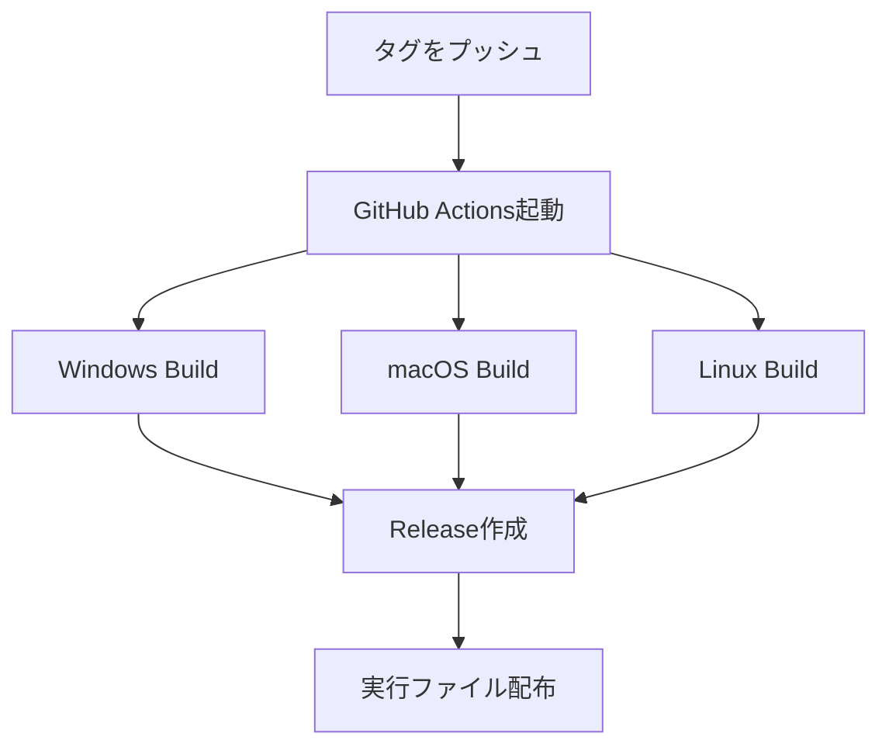

# バージョン管理ガイド

AttureExpenceのバージョン管理とリリース手順

## 📋 目次
- [概要](#概要)
- [セマンティックバージョニング](#セマンティックバージョニング)
- [バージョンアップ手順](#バージョンアップ手順)
- [自動リリースシステム](#自動リリースシステム)
- [アップデート機能](#アップデート機能)
- [トラブルシューティング](#トラブルシューティング)

## 📖 概要

このプロジェクトは以下のバージョン管理システムを採用しています：

- **セマンティックバージョニング** (SemVer): `MAJOR.MINOR.PATCH`形式
- **GitHub Actions** による自動ビルド・リリース
- **アプリ内アップデート通知** システム
- **クロスプラットフォーム対応** (Windows, macOS, Linux)

## 🔢 セマンティックバージョニング

### バージョン番号の意味

```
MAJOR.MINOR.PATCH
  │     │     └── パッチバージョン: バグ修正
  │     └──────── マイナーバージョン: 新機能追加（後方互換性あり）
  └──────────── メジャーバージョン: 破壊的変更

例: 1.2.3
```

### いつどのバージョンを上げるか

| 変更内容 | バージョン | コマンド | 例 |
|---------|----------|----------|-----|
| **バグ修正** | PATCH | `npm version patch` | 1.0.0 → 1.0.1 |
| **新機能追加** | MINOR | `npm version minor` | 1.0.0 → 1.1.0 |
| **破壊的変更** | MAJOR | `npm version major` | 1.0.0 → 2.0.0 |

## 🚀 バージョンアップ手順

### 📝 事前準備

1. **開発ブランチの確認**
   ```bash
   git status
   git log --oneline -5  # 最近のコミットを確認
   ```

2. **ローカルビルドテスト**
   ```bash
   npm run build
   npm run build:win   # Windows用（オプション）
   npm run build:mac   # macOS用（オプション）
   npm run build:linux # Linux用（オプション）
   ```

### 🏷️ Step 1: バージョン番号の更新

#### 自動更新（推奨）
```bash
# パッチバージョン（バグ修正）
npm version patch

# マイナーバージョン（新機能）
npm version minor

# メジャーバージョン（破壊的変更）
npm version major
```

#### 手動更新
`package.json`の`version`フィールドを手動で変更:
```json
{
  "version": "1.0.1"
}
```

### 📄 Step 2: CHANGELOGの更新

`CHANGELOG.md`に新しいバージョンの変更内容を追加:

```markdown
## [1.0.1] - 2025-05-30

### 追加
- ✨ 新機能: ユーザー管理機能
- 🔄 アップデート通知システム

### 修正
- 🐛 ユーザーカードの表示問題を修正
- 🧹 未使用コードの削除

### 変更
- 🎨 UI/UXの改善
- ⚡ パフォーマンスの向上

### 削除
- ❌ 非推奨機能の削除
```

### 💾 Step 3: コミット

```bash
# ファイルをステージング
git add package.json CHANGELOG.md

# コミット（わかりやすいメッセージで）
git commit -m "Bump version to 1.0.1

- Add user management feature
- Fix display issues
- Improve performance"
```

### 🏷️ Step 4: タグの作成

```bash
# タグを作成
git tag v1.0.1

# タグを確認
git tag -l
```

### 🚀 Step 5: プッシュ

```bash
# メインブランチをプッシュ
git push origin main

# タグをプッシュ（GitHub Actionsが自動実行される）
git push origin v1.0.1

# または、すべてのタグを一括プッシュ
git push --tags
```

## 🤖 自動リリースシステム

### GitHub Actionsワークフロー

タグをプッシュすると、以下が自動実行されます：



### 生成される成果物

- 🪟 **Windows**: `AttureExpence-Setup-1.0.1.exe`
- 🍎 **macOS**: `AttureExpence-1.0.1.dmg`
- 🐧 **Linux**: `AttureExpence-1.0.1.AppImage`

### ワークフロー確認方法

1. **GitHubリポジトリ** → **Actions**タブ
2. ワークフローの実行状況を確認
3. **Releases**タブで成果物をダウンロード

## 🔄 アップデート機能

### ユーザー向けアップデート通知

アプリには自動アップデートチェック機能が組み込まれています：

- **設定** → **アップデート**で手動チェック可能
- 自動チェック間隔の設定（1時間〜1週間）
- デスクトップ通知でアップデート通知
- GitHub Releasesから自動でバージョン確認

### アップデート設定

```javascript
// 自動チェック間隔の設定
updateService.updateSettings({
  autoCheck: true,
  checkInterval: 24, // 24時間ごと
  showNotifications: true
});
```

## 🔧 トラブルシューティング

### よくある問題と解決方法

#### 1. タグが既に存在する

```bash
# エラー: tag 'v1.0.0' already exists
git tag -d v1.0.0              # ローカルタグを削除
git push origin :refs/tags/v1.0.0  # リモートタグを削除
```

#### 2. GitHub Actionsが失敗する

**ESLintエラーの場合:**
```bash
npm run build  # ローカルでエラーを確認
# エラーを修正後、再度バージョンアップ
```

**権限エラーの場合:**
- GitHubリポジトリの**Settings** → **Actions**で権限を確認
- `GH_TOKEN`の権限を確認

#### 3. ビルドが失敗する

**依存関係の問題:**
```bash
npm ci                    # クリーンインストール
rm -rf node_modules       # node_modulesを削除
npm install               # 再インストール
```

**プラットフォーム固有の問題:**
- Windows: Visual Studio Build Toolsが必要
- macOS: Xcodeが必要
- Linux: 追加パッケージが必要な場合がある

#### 4. アップデート通知が動作しない

**設定確認:**
```javascript
// updateService.jsの設定を確認
this.updateCheckUrl = 'https://api.github.com/repos/your-username/AttureExpence/releases/latest';
```

**リポジトリURLの更新:**
実際のGitHubリポジトリURLに変更する必要があります。

## 📚 参考情報

### 関連ファイル

- `package.json`: バージョン情報
- `CHANGELOG.md`: 変更履歴
- `.github/workflows/release.yml`: GitHub Actionsワークフロー
- `src/services/updateService.js`: アップデートサービス
- `src/components/Settings/UpdateSettings.js`: アップデート設定UI

### 便利なコマンド

```bash
# 現在のバージョンを確認
npm version

# 特定のバージョンにタグを作成
git tag v1.0.0 HEAD

# タグの履歴を確認
git tag -l --sort=-version:refname

# 特定のタグを削除
git tag -d v1.0.0
git push origin :refs/tags/v1.0.0

# リリース履歴を確認
git log --oneline --decorate --graph
```

### GitHub CLI（オプション）

GitHub CLIを使用すると、コマンドラインからリリースを作成できます：

```bash
# GitHub CLIでリリースを作成
gh release create v1.0.1 --title "Release v1.0.1" --notes-file CHANGELOG.md

# ドラフトリリースを作成
gh release create v1.0.1 --draft --title "Release v1.0.1"
```

---

## 🎯 クイックリファレンス

### バグ修正リリース（最も一般的）

```bash
npm version patch
git push && git push --tags
```

### 新機能リリース

```bash
# 1. CHANGELOGを更新
# 2. バージョンアップ
npm version minor
git add CHANGELOG.md
git commit --amend --no-edit
git push && git push --tags
```

### 緊急リリース

```bash
# 1. ホットフィックスを適用
# 2. すぐにリリース
npm version patch
git push && git push --tags
# 3. GitHub Actionsの完了を確認
```

このガイドに従って、安全で効率的なバージョン管理を行ってください！ 🚀